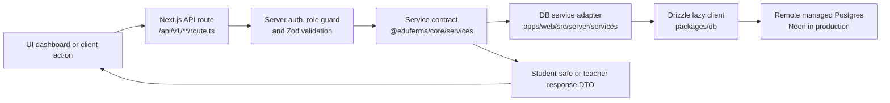
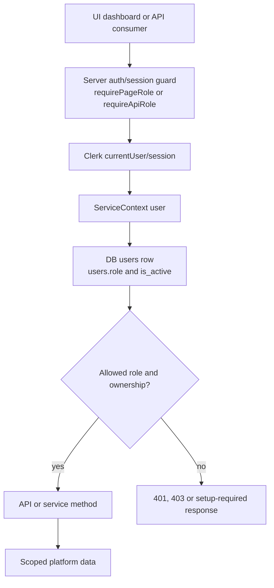

# EduFerma

EduFerma — публичный monorepo веб-платформы для репетиторского бренда `lkeey`.

Репозиторий хранит только код платформенного слоя: лендинг, invite-only кабинеты,
shared packages, схему БД, валидаторы, import/dry-run scripts и quality gates.
Локальная учебная мастерская `/Users/lkeey/IT` остается отдельным источником
материалов, student spaces, корпуса задач и методических артефактов.

## Stack

- pnpm workspaces + Turborepo;
- Next.js App Router, React and TypeScript in `apps/web`;
- invite-only auth through Clerk with server-side role guards;
- Drizzle ORM with Neon Postgres schema and lazy runtime client in `packages/db`;
- remote managed Postgres for production data, local DB/mock data only for dev, tests, dry runs and seeds;
- shared service/domain logic in `packages/core`;
- Zod validators and OpenAPI contract packages for API request/response schemas;
- Vitest unit tests, Playwright e2e tests, Turbo task orchestration and project lint/self-review gates;
- worker dry-run jobs in `apps/worker`, including Telegram assignment delivery contracts;
- lightweight shadcn/new-york inspired UI primitives in `packages/ui`;
- Vercel preview deploy first, production promotion only after confirmation.

## API Contract

Local, preview and production deployments expose the API documentation paths:

- OpenAPI JSON: `/api/openapi.json`
- Swagger UI: `/api/docs`

API changes are governed by the generated OpenAPI contract. Run these before
shipping new or changed API routes:

```bash
pnpm api:openapi:generate
pnpm api:openapi:check
pnpm api:governance
```

See [docs/api.md](docs/api.md) and
[docs/openapi-workflow.md](docs/openapi-workflow.md) for the route checklist.

## Runtime Request Flow

API-backed platform data should move through route handlers, service methods and
the DB package instead of bypassing the API contract.



When `DATABASE_URL` is absent, DB-backed flows must return a controlled setup or
unavailable response. They must not silently fall back to local JSON, SQLite or
demo fixtures as a production substitute.

## Auth And Role Guards

Protected pages and API routes enforce auth on the server. The first guard uses
the Clerk-backed session, then DB services resolve the linked `users` row and
apply `users.role` plus ownership checks before reading or mutating data.



Student-facing serializers must not return answers, solutions, teacher notes or
private source paths. Teacher endpoints need server-side role checks even when
UI navigation already hides the route.

## Production API

Live site:

- App: <https://edu-ferma-web.vercel.app>
- Health: <https://edu-ferma-web.vercel.app/api/health>
- OpenAPI JSON: <https://edu-ferma-web.vercel.app/api/openapi.json>
- Swagger UI: <https://edu-ferma-web.vercel.app/api/docs>

Production data is served from remote Neon Postgres. The repository includes a
small curated original task seed for bootstrapping real task-bank rows without
using mocks or the private local corpus.

## Local Start

```bash
pnpm install
pnpm dev
```

Quality gate:

```bash
pnpm lint
pnpm typecheck
pnpm test
pnpm build
pnpm web:self-review
pnpm api:governance
```

Dry-run импорт локального task bank:

```bash
pnpm tasks:sync --dry-run
```

Dry-run импорт curated original task seed:

```bash
pnpm tasks:sync --dry-run --path=packages/db/seed/task-bank-curated-original.jsonl
```

`--apply` intentionally refuses invalid or `needs_review` tasks and requires
real infrastructure env vars.

## Environment

Copy `.env.example` to `.env.local` locally. Never commit `.env*`, secrets,
tokens, cookies, production DB URLs or private local corpus paths.

Key env vars:

- `OWNER_EMAIL` — bootstrap owner email;
- `NEXT_PUBLIC_TELEGRAM_URL` — CTA to Telegram;
- Clerk keys — invite-only authentication;
- `DATABASE_URL` — Neon Postgres;
- `EDUFERMA_DB_SIZE_LIMIT_MB` — DB storage guardrail, default 500 MB;
- `BLOB_READ_WRITE_TOKEN` — Vercel Blob.

Production secrets live in Vercel or GitHub secrets. Local DBs and local JSON are
only for development, tests, dry-run import and seed generation; production data
must live in remote managed Postgres. See
[docs/database-architecture.md](docs/database-architecture.md) and
[docs/privacy-and-security.md](docs/privacy-and-security.md).

Operational helpers:

```bash
pnpm db:size:check -- --max-db-mb=500
pnpm access:bootstrap -- --email=teacher@example.com --role=teacher --invite
```

See `docs/account-access.md` for owner bootstrap, Clerk linking and
student/teacher access rows.
