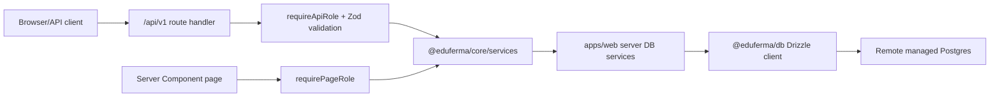

# API

EduFerma uses API-first data access for platform data. Business endpoints live
under `/api/v1`.

## OpenAPI And Swagger

- OpenAPI JSON: `/api/openapi.json`
- Swagger UI: `/api/docs`
- Contract registry: `packages/api-contract/src/registry.ts`
- OpenAPI generator: `packages/api-contract/src/openapi.ts`
- Tracked generated JSON: `packages/api-contract/openapi.json`
- Runtime routes: `apps/web/src/app/api/**/route.ts`
- Swagger page implementation: `apps/web/src/app/api/docs/page.tsx`

Both are controlled by `OPENAPI_DOCS_ENABLED`. In production this can be set to
`false` to hide docs without breaking the app.

## Request Flows

EduFerma keeps `/api/v1` as the stable HTTP contract for browser clients,
external integrations, mobile/PWA and future automations. Server-rendered Next.js
pages may call the same service layer directly instead of making a loopback HTTP
request.



Both paths must use the same role checks, service contracts and serializers.
Neither path may read production data from local JSON/mock fixtures.

## Auth Routing

The canonical post-login target is `/auth/after-sign-in`. Clerk redirects there
after sign-in, then the server resolves the current EduFerma role and sends
teacher-side users to `/teacher/dashboard`, student-side users to
`/student/dashboard`, and signed-in users without active access to
`/access-pending`.

`apps/web/src/proxy.ts` intentionally keeps Clerk middleware lightweight. Page
authorization is enforced by server component guards such as
`requireTeacherAccess` and `requireStudentAccess`; versioned API authorization is
enforced inside route handlers with `requireApiRole`. This keeps `/api/v1/**`
returning controlled JSON errors (`401`, `403`, `503`) instead of middleware
rewrites.

## Route Matrix

The authoritative route list lives in `routeDefinitions`. Current groups:

| Group | Routes | Notes |
| --- | --- | --- |
| Health/Auth | `/api/health`, `/api/health/db`, `/api/openapi.json`, `/api/demo-auth/*`, `/api/v1/me`, `/api/v1/diagnostics` | Public health/docs plus protected DB health/current user and signed-in diagnostics. Demo auth is development/test only. |
| Task bank MVP | `/api/v1/task-bank` | Signed-in users only. Student-safe payloads must omit answers, solutions, teacher notes and local/internal source paths. |
| Student | `/api/v1/student/dashboard`, `/schedule`, `/plan`, `/assignments`, `/assignments/{assignmentId}`, `/tasks/{taskId}`, `/tasks/{taskId}/attempts`, `/progress` | Student-safe serializers must omit answers, solutions, teacher notes and local/internal source paths. |
| Teacher | `/api/v1/teacher/dashboard`, `/students`, `/students/{studentId}`, `/students/{studentId}/plan`, `/students/{studentId}/schedule`, `/students/{studentId}/assignments`, `/students/{studentId}/analytics`, `/task-bank`, `/tasks/{taskId}` | Teacher routes require server-side teacher/owner/tutor role checks and ownership checks where a student is addressed. |
| Assignments/Attempts | `/api/v1/teacher/assignments`, `/api/v1/teacher/assignments/{assignmentId}`, `/api/v1/teacher/assignments/{assignmentId}/publish`, `/api/v1/teacher/attempts/pending-review`, `/api/v1/teacher/attempts/{attemptId}/review` | Teacher assignment list/detail routes are teacher-only and ownership-scoped. Mutating operations must validate request bodies with Zod and be present in OpenAPI. |
| Legacy compatibility | `/api/student/attempts`, `/api/teacher/reviews` | Kept for compatibility; new product work should prefer `/api/v1`. |

## Adding A Route

1. Add `apps/web/src/app/api/v1/**/route.ts`.
2. Add or reuse request and response schemas.
3. Enforce auth, role and ownership on the server.
4. Return only serialized safe fields.
5. Add an OpenAPI operation.
6. Add tests.
7. Run `pnpm api:governance`.

No `/api/v1` route is complete until it is present in OpenAPI.

## Integration Webhooks

Integration callbacks that are provider-owned, such as
`POST /api/integrations/telegram/webhook`, are not part of the versioned
EduFerma public API contract and are intentionally excluded from OpenAPI. They
must still validate provider authentication, validate request shape, avoid
printing secrets, and have tests. Telegram webhook details live in
`docs/telegram-delivery.md`.

## Error Shape

```json
{
  "error": {
    "code": "VALIDATION_ERROR",
    "message": "Invalid request",
    "details": {}
  }
}
```

Standard codes: `UNAUTHORIZED`, `FORBIDDEN`, `NOT_FOUND`,
`VALIDATION_ERROR`, `CONFLICT`, `RATE_LIMITED`, `SETUP_REQUIRED`,
`INTERNAL_ERROR`.

## Security

Protected operations use Clerk-backed session auth plus remote DB role/access
checks. Clerk proves identity; the `users`, `students`, and
`teacher_student_links` rows decide dashboard/API authorization. Demo auth is
permitted only when `ENABLE_DEMO_AUTH=true` and `NODE_ENV !== "production"`.

If Clerk env is missing, protected APIs return `SETUP_REQUIRED` with missing
env names, not secret values.

Student APIs must never include `answer_json`, `solution_md`, teacher notes or
local/internal source paths.

## Contract Hardening Backlog

The current contract governance blocks undocumented routes and missing auth/test
patterns. Remaining hardening items:

- add per-route success status metadata so `201` responses are represented
  precisely, not only generic `200`;
- map Zod request/response schemas to OpenAPI components so generated schemas
  cannot drift from validators;
- update the `clerkAuth` security scheme description to reflect Clerk
  session/cookie auth plus DB role resolution;
- keep `/api/docs` smoke coverage in tests, not only `/api/openapi.json`;
- make new internal non-OpenAPI integration routes explicitly documented in
  `scripts/api-governance.ts` exceptions.

## Remote DB Smoke Tests

The default test suite does not touch a real database. To prove that route
handlers can read and write through the remote Postgres service path, run the
gated smoke test against a development or test database only:

```bash
EDUFERMA_RUN_REMOTE_DB_TESTS=true \
EDUFERMA_DB_ENV=test \
DATABASE_URL=<remote-dev-or-test-postgres-url> \
pnpm test:remote-db
```

The smoke gate uses the same runtime DB env detection as the API service path:
explicit `DATABASE_URL`/`POSTGRES_URL` values and supported Vercel/Neon
provider aliases are accepted.

The smoke test creates unique `smoke_*` users, student, task, assignment,
schedule, progress and attempt rows, calls representative `/api/v1` route
handlers, verifies student payloads omit teacher-only fields, verifies teacher
payloads include them, and then deletes only the rows it created. It refuses to
run when the environment is marked production.
