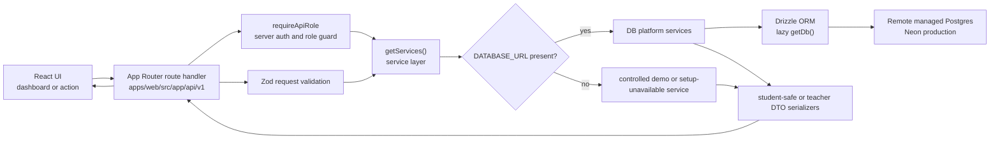
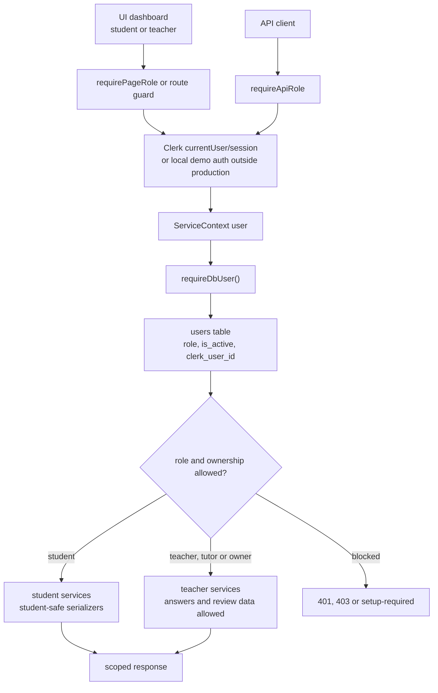

# EduFerma Architecture

EduFerma is a small production-oriented monorepo:

- public Russian landing for the `lkeey` tutor brand;
- invite-only student and tutor dashboards;
- shared domain packages for roles, task import, answer checking and mastery;
- Drizzle schema prepared for Neon Postgres;
- local-first dry-run sync from the teaching workshop.

The public repository never owns the raw teaching corpus. It only contains code
that can validate, summarize and safely import approved rows into platform data.

## Apps

- `apps/web` is the only user-facing app in the MVP.
- `apps/worker` is a placeholder for future scheduled jobs, reminders and
  analytics rollups.

## Packages

- `packages/db`: database schema and lazy `getDb()`.
- `packages/core`: business rules independent of React/Next.
- `packages/validators`: Zod schemas for task rows and student sync payloads.
- `packages/ui`: owned source UI primitives.
- `packages/config`: routes, roles, constants and public app config.

## Request Flow

The platform is API-first for persistent data. UI screens and external clients
should rely on `/api/v1/**` contracts, and route handlers delegate business work
to the shared service layer before touching the database.

The production path is remote Postgres through Neon. Local Postgres, mocks and
local JSON are acceptable only for development, tests, dry-run import and seed
generation. Production code must not treat local files or fixtures as a fallback
source of truth.

## Auth And Role Guard Flow

Route visibility in the UI is only a convenience. Every protected page and API
operation must enforce access on the server and then re-check platform role and
ownership inside DB-backed services.

Student services must remove teacher-only fields such as answers, solutions,
teacher notes and local/internal source paths. Teacher services still scope data
by ownership links unless the DB role is `owner`.

## API And OpenAPI

- OpenAPI JSON is served at `/api/openapi.json`.
- Swagger UI is served at `/api/docs`.
- The generated contract lives in `packages/api-contract/openapi.json`.
- API governance is run with `pnpm api:governance`; use
  `pnpm api:openapi:generate` and `pnpm api:openapi:check` when changing route
  definitions or schemas.

See `docs/api.md`, `docs/openapi-workflow.md`, `docs/api-security.md` and
`docs/database-architecture.md` for the operational checklists.
