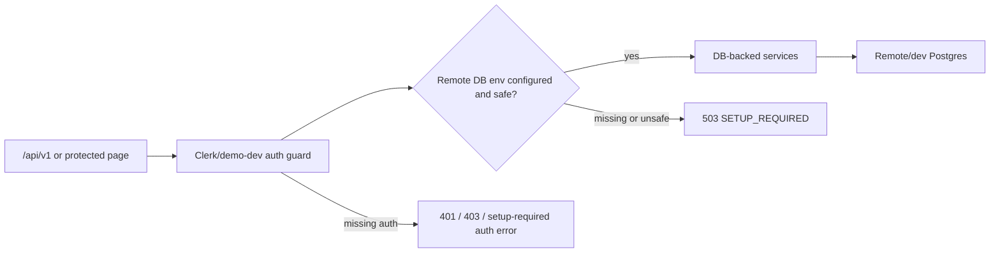

# Database Architecture

## Production Source Of Truth

Production data must live in a remote managed Postgres database. The preferred
provider is Neon Postgres through Vercel Marketplace because it provides
serverless Postgres, Vercel env integration, branching and pooled runtime
connections.

Do not use SQLite, local files, local JSON, or demo fixtures as production
source of truth.

## Local And Dev Sources

Allowed development sources:

- remote Neon dev branch;
- local Postgres through Docker;
- mock repositories only in unit tests;
- local JSON only for dry-run import and seed generation.

SQLite is not part of the production-compatible path and should not be added as
a runtime fallback.

## Setup / Unavailable Flow

Runtime code uses a lazy `getDb()` initializer. It does not create a DB client
at module import time, so builds can complete before Vercel injects env vars.
When code actually needs the database, `DATABASE_URL` must be present and must
be a `postgres://` or `postgresql://` URL.

If the URL is missing, DB-backed flows must return a controlled setup or
unavailable response. They must not silently read local JSON, SQLite, local
files, or demo fixtures as a production substitute.

For HTTP requests this means:



`ENABLE_DEMO_AUTH=true` is allowed only outside production. In production-marked
environments, demo auth must not become a fixture-backed substitute for remote
DB data.

When `VERCEL_ENV=production`, `EDUFERMA_DB_ENV=production`, or `NODE_ENV=production`
without a preview override, `DATABASE_URL` and `DIRECT_DATABASE_URL` are rejected
if they point at `localhost`, `127.0.0.1`, `::1`, or another local host.

## Required Env Vars

- `DATABASE_URL`: pooled runtime Postgres URL for Next.js route handlers and services.
- `DIRECT_DATABASE_URL`: direct Postgres URL for migrations, if the provider gives one.
- Neon/Vercel Marketplace aliases: if a Vercel integration injects prefixed
  keys such as `*_DATABASE_URL`, `*_DATABASE_URL_UNPOOLED`,
  `*_POSTGRES_URL`, or `*_POSTGRES_URL_NON_POOLING`, the DB config treats them
  as provider aliases. Explicit `DATABASE_URL` and `DIRECT_DATABASE_URL` still
  take priority.
- `EDUFERMA_DB_ENV`: optional DB environment marker; use `production` only for
  the production database and `development` for local/dev branches.
- `EDUFERMA_ALLOW_PRODUCTION_SEED`: must remain `false` unless a one-off,
  reviewed production seed is intentionally being run.
- `EDUFERMA_ALLOW_IMPORT_APPLY`: must remain `false` unless a reviewed
  production import is intentionally being run.
- `EDUFERMA_DB_SIZE_LIMIT_MB`: DB storage guardrail. Default is `500`.
- `NEXT_PUBLIC_APP_URL`: canonical app URL.
- `CLERK_SECRET_KEY`: Clerk server key.
- `NEXT_PUBLIC_CLERK_PUBLISHABLE_KEY`: Clerk browser key.
- `OWNER_EMAIL`: bootstrap owner email.
- `ENABLE_DEMO_AUTH`: local/test demo auth only; must remain false in production.
- `OPENAPI_DOCS_ENABLED`: controls `/api/docs` and `/api/openapi.json`.

Never commit real values.

## Import Safety And Size Limit

Production task import accepts only `status=active` tasks with
`verification_status=verified|checked` and
`license_status=original|granted|public_reference`. Rows marked
`needs_review`, `unverified`, `unknown` verification/license, restricted
license, manual skill mapping, or binary-looking text are excluded from active
production import.

Every dry-run prints a size estimate and the active DB limit. Apply mode checks
the current remote DB size plus the import estimate and refuses the write if the
projection exceeds `EDUFERMA_DB_SIZE_LIMIT_MB`:

```bash
pnpm tasks:sync --dry-run --max-db-mb=500
pnpm db:size:check -- --max-db-mb=500
```

For a staged local corpus import, keep the first apply scoped and reviewed:

```bash
pnpm tasks:sync --dry-run --limit=100 --max-db-mb=500
EDUFERMA_ALLOW_IMPORT_APPLY=true pnpm tasks:sync --apply --allow-partial --limit=100 --max-db-mb=500
```

## Migrations

Generate migrations:

```bash
pnpm db:generate
```

Run migrations against a configured database. DB scripts load `.env.local` from
the workspace root if it exists, while real shell/Vercel env vars still win:

```bash
pnpm db:migrate
```

Use `DIRECT_DATABASE_URL` for migrations when available. If it is absent,
Drizzle falls back to `DATABASE_URL`. `pnpm db:generate` can run before env
setup because it only compares schema files. `pnpm db:migrate`, `pnpm db:push`
and `pnpm db:studio` require `DIRECT_DATABASE_URL` or `DATABASE_URL`.

Preferred manual provisioning sequence:

```bash
vercel link
vercel integration add neon
vercel env pull .env.local --yes
pnpm db:migrate
```

Do not invent or commit database URLs. If Neon is provisioned outside Vercel
Marketplace, add the pooled runtime URL as `DATABASE_URL`, add the direct URL as
`DIRECT_DATABASE_URL`, and then pull/sync env vars locally.

## Remote DB Setup Status

Last checked: 2026-07-11.

Vercel project `edu-ferma-web` exists under team `lkeey` and is linked to the
Next.js app. Neon Marketplace env vars are present with provider prefixes, so
runtime code supports those aliases in addition to explicit `DATABASE_URL` and
`DIRECT_DATABASE_URL`.

No paid resource is created by the app code. When Neon is connected through
Vercel Marketplace, prefer the injected provider env vars or add these aliases
manually in Vercel/local `.env.local`:

- `DATABASE_URL`: pooled Postgres runtime URL.
- `DIRECT_DATABASE_URL`: direct Postgres migration URL, when provided by the
  database provider.

After a free/existing Neon or Vercel Postgres resource is connected, run:

```bash
pnpm db:migrate
pnpm db:seed -- --apply
```

For production, `pnpm db:seed -- --apply` still requires the documented
break-glass override and backup/migration review.

## Remote DB API Smoke Test

After migrations are applied to a remote development or test database, use the
gated API smoke test to verify the full route handler path:

```bash
EDUFERMA_RUN_REMOTE_DB_TESTS=true \
EDUFERMA_DB_ENV=test \
DATABASE_URL=<remote-dev-or-test-postgres-url> \
pnpm test:remote-db
```

The smoke gate follows the same runtime DB env detection as the app, so it also
runs when a supported provider alias such as `*_DATABASE_URL` or
`*_POSTGRES_URL` is present instead of explicit `DATABASE_URL`.

This test is skipped by default. It should never be pointed at the production
database. The test also refuses to run when `VERCEL_ENV=production`,
`EDUFERMA_DB_ENV=production`, or `NODE_ENV=production`.

## Seed

Dry-run seed preview:

```bash
pnpm db:seed -- --dry-run
```

Apply seed:

```bash
pnpm db:seed -- --apply
```

The seed script refuses `--apply` without `DATABASE_URL`, refuses non-Postgres
URLs, and refuses production seed apply unless both conditions are true:

```bash
EDUFERMA_ALLOW_PRODUCTION_SEED=true pnpm db:seed -- --apply --allow-production-seed
```

That override is a manual break-glass flow and should only be used after backup
and migration review. Demo seed rows use stable IDs and `onConflictDoNothing()`
so repeated non-production applies are idempotent.

## Importing Tasks From The Local Corpus

The local teaching workshop remains outside this public repository. Import from
the normalized corpus with dry-run first:

```bash
pnpm tasks:sync --dry-run
```

Apply mode writes importable rows into the configured remote/dev DB using an
idempotent upsert on `task_id`. By default it refuses to apply when the source
contains invalid, duplicate, restricted, or `needs_review` task rows.

For large mixed-review corpora, `pnpm tasks:sync --apply --allow-partial` may be
used after dry-run review. Partial apply still writes only rows classified as
safe verified `import` decisions; invalid and manual-review rows remain
unwritten.

Production import apply is also blocked unless
`EDUFERMA_ALLOW_IMPORT_APPLY=true` is set after source, mapping, and backup
review.

For first production bootstrap, use the tracked original curated seed instead of
the private local corpus:

```bash
pnpm tasks:sync --dry-run --path=packages/db/seed/task-bank-curated-original.jsonl
EDUFERMA_ALLOW_IMPORT_APPLY=true pnpm tasks:sync --apply --path=packages/db/seed/task-bank-curated-original.jsonl
```

## Production Safety

- Run migrations before deploying code that depends on new columns.
- Do not run seed against production unless the seed is explicitly production-safe.
- Do not point production at a local host, file path, SQLite DB, or unreviewed dump.
- Treat local task corpus paths as private implementation detail; do not expose
  them through student APIs.

## Backup / Restore

TODO before real production data:

- document Neon backup/restore steps;
- document branch restore procedure;
- document point-in-time recovery availability for the chosen plan;
- add a pre-migration backup checklist.
